# CI/CD Pipeline — Orbit Platform

Документація архітектури та процесів безперервної інтеграції (CI) та безперервної доставки/деплою (CD) для розподіленої IoT платформи **Orbit**.

---

## 1. Загальний огляд

Автоматизація побудована на базі **GitHub Actions** і складається з двох взаємодоповнюючих конвеєрів:

1. **CI Pipeline ([`.github/workflows/ci.yml`](../.github/workflows/ci.yml))**:
   - Перевіряє коректність коду, контрактів та конфігурацій для кожного Pull Request та комміту.
   - Запускає наскрізні тести інфраструктури (Фази 1–5) та компіляцію/тестування всіх Java 25 сервісів.
2. **CD Pipeline ([`.github/workflows/cd.yml`](../.github/workflows/cd.yml))**:
   - Збирає та публікує оптимізовані Docker-образи всіх мікросервісів у **GitHub Container Registry (GHCR)**.
   - Проводить сканування безпеки на рівні конфігурацій та вразливостей бібліотек (**Trivy**).
   - Підписує контейнери за допомогою безключового підпису **Cosign (Sigstore)** через GitHub OIDC.
   - Пакує та публікує **Helm Chart** в OCI-реєстр GHCR.
   - Розгортає повноцінний тимчасовий **k3d Kubernetes кластер** прямо в CI runner, деплоїть платформу через Helm та проводить живі **Smoke-тести**.

---

## 2. Діаграма архітектури CI/CD

```mermaid
flowchart TD
    subgraph Trigger ["Тригери"]
        PR["Pull Request"]
        Push["Push to main / Tag v*"]
        Manual["Manual workflow_dispatch"]
    end

    subgraph CI ["CI Pipeline (ci.yml)"]
        direction TB
        subgraph InfraJob ["Job: infra-tests"]
            P1["Phase 1: Terraform & LocalStack"]
            P2["Phase 2: Ingest & Processor (gRPC)"]
            P3["Phase 3: Orchestrator & Camunda"]
            P4["Phase 4: Gateway & mTLS"]
            P5["Phase 5: Helm & K8s Validation"]
            P1 --> P2 --> P3 --> P4 --> P5
        end

        subgraph MavenJob ["Job: maven-tests (Java 25)"]
            GenCerts["Generate mTLS Certs"]
            MvnTest["mvn clean test"]
            UploadReports["Upload Surefire Reports"]
            GenCerts --> MvnTest --> UploadReports
        end
    end

    subgraph CD ["CD Pipeline (cd.yml)"]
        direction TB
        PreFlight["1. Pre-flight & Linting\n(helm lint --strict, Trivy config)"]

        subgraph BuildPush ["2. Build & Push (Matrix: 4 сервіси)"]
            Buildx["Docker Buildx + Layer Cache"]
            GHCR["Push to ghcr.io"]
            TrivyScan["Trivy CVE Image Scan"]
            CosignSign["Cosign OIDC Sign"]
            Buildx --> GHCR --> TrivyScan --> CosignSign
        end

        subgraph HelmOCI ["3. Helm Package & OCI"]
            HelmPkg["helm package orbit-chart"]
            HelmPush["helm push to oci://ghcr.io/.../charts"]
            HelmPkg --> HelmPush
        end

        subgraph K8sDeploy ["4. Ephemeral k3d Deploy & Smoke"]
            K3dCreate["k3d cluster create orbit-ci"]
            CertsSecret["Generate mTLS & K8s Secret"]
            MetricsServer["Install metrics-server (HPA)"]
            HelmDeploy["helm upgrade --install orbit"]
            VerifyState["Verify Pods, Services & HPA"]
            SmokeTests["Live Smoke Tests (/actuator/health)"]

            K3dCreate --> CertsSecret --> MetricsServer --> HelmDeploy --> VerifyState --> SmokeTests
        end

        PreFlight --> BuildPush
        PreFlight --> HelmOCI
        BuildPush --> K8sDeploy
        HelmOCI --> K8sDeploy
    end

    PR --> CI
    Push --> CI
    Push --> CD
    Manual --> CD
```



---

## 3. Детальний опис CI Pipeline

**Файл:** [`.github/workflows/ci.yml`](../.github/workflows/ci.yml)  
**Тригери:** `push: [main, master]`, `pull_request: [main, master]`, `workflow_dispatch`.

### 3.1. Job `infra-tests` (Інфраструктура, контракти та конфігурації)
- **Середовище:** `ubuntu-latest`.
- **Встановлені інструменти:** OpenSSL, Java 25 (Temurin), Helm CLI (`azure/setup-helm@v4`).
- **Кроки:**
  1. Створення середовища `.env` (з `.env.example`).
  2. Запуск [`tests/test-phase1.sh`](../tests/test-phase1.sh): Terraform (S3, SQS, SNS, LocalStack), сертифікати mTLS CA, валідація `docker-compose.yml`.
  3. Запуск [`tests/test-phase2.sh`](../tests/test-phase2.sh): Реактивний конвеєр `orbit-ingest`, детекція аномалій `orbit-processor`, двонаправлений gRPC streaming та protobuf-контракти.
  4. Запуск [`tests/test-phase3.sh`](../tests/test-phase3.sh): BPMN-оркестратор `orbit-orchestrator`, вбудований рушій Camunda 7, перевірка Java-делегатів та життєвого циклу тікетів.
  5. Запуск [`tests/test-phase4.sh`](../tests/test-phase4.sh): API Gateway (`orbit-gateway`), маршрутизація, Resilience4j Circuit Breakers, фільтри mTLS і security headers.
  6. Запуск [`tests/test-phase5.sh`](../tests/test-phase5.sh): Helm-чарт `orbit-chart`, HPA політики (`autoscaling/v2`), readiness/liveness проби, рендеринг маніфестів (`helm template`) та синтаксичний аналіз (`helm lint`).

### 3.2. Job `maven-tests` (Компіляція та модульне тестування)
- **Середовище:** `ubuntu-latest`, Java 25 (Temurin) з кешуванням залежностей Maven.
- **Кроки:**
  1. Генерація mTLS сертифікатів через `infra/certs/generate-certs.sh`.
  2. Виконання `mvn clean test --batch-mode --no-transfer-progress -e`.
  3. У разі збою — автоматичне збереження та завантаження звітів `**/target/surefire-reports/` як workflow artifact.

---

## 4. Детальний опис CD Pipeline

**Файл:** [`.github/workflows/cd.yml`](../.github/workflows/cd.yml)  
**Тригери:**
- `push: [main]`
- `push tags: ['v*.*.*']` (семантичні релізи)
- `workflow_dispatch` (ручний запуск з вибором оточення: `dev`, `staging`, `production`)

### 4.1. Етап 1: `pre-flight` (Перевірка якості та безпеки)
- Виконує строгий лінтинг чарту: `helm lint infra/k8s/orbit-chart --strict`.
- Виконує тестовий рендеринг шаблонів (`helm template --dry-run`).
- Запускає **Trivy config scanner** для аналізу маніфестів Kubernetes на відповідність кращим практикам безпеки (CIS Kubernetes Benchmarks).

### 4.2. Етап 2: `build-and-push` (Збірка, безпека та підпис образів)
- **Matrix Build:** виконується паралельно для 4 мікросервісів:
  - `orbit-ingest`
  - `orbit-processor`
  - `orbit-orchestrator`
  - `orbit-gateway`
- **Docker Buildx & Кешування:**
  - Кешування шарів через `type=gha,mode=max` (прискорює збірку Maven у Docker до декількох секунд).
- **Тегування:**
  - `sha-<commit_sha>` — унікальний імутабельний тег коміту.
  - `latest` — для гілки `main`.
  - `vX.Y.Z` / `vX.Y` — для релізних тегів.
- **Реєстр:** GitHub Container Registry (`ghcr.io/kuum-oss/...`).
- **DevSecOps (Trivy Scan):**
  - Сканування опублікованого образу на вразливості ОС та залежностей Java (HIGH, CRITICAL).
- **Підпис образів (Cosign):**
  - Безключовий підпис дайджесту образу через Sigstore та GitHub OIDC токен (`id-token: write`). Гарантує supply-chain безпеку та автентичність образу.

### 4.3. Етап 3: `publish-helm-chart` (Реліз Helm чарту в OCI)
- Пакує чарт у `.tgz` архів з версією релізу: `helm package infra/k8s/orbit-chart`.
- Публікує чарт до OCI-реєстру GHCR: `helm push dist/*.tgz oci://ghcr.io/<owner>/charts`.
- Зберігає архів чарту як артефакт пайплайну на 14 днів.

### 4.4. Етап 4: `e2e-k3d-deploy` (Живий деплой у K8s та Smoke-тестування)
Найважливіший крок підтвердження працездатності:
1. **Кластер k3d:** в runner розгортається тимчасовий multi-node кластер k3d (`1 server, 1 agent`) з вимкненим дефолтним Traefik та прокиданням порту `8080`.
2. **mTLS у K8s:** генеруються сертифікати та створюється Kubernetes Secret `orbit-certs`.
3. **HPA:** встановлюється `metrics-server` з флагом `--kubelet-insecure-tls`.
4. **Helm Деплой:** виконується `helm upgrade --install orbit` з переозначенням образів на свіжозібрані з GHCR (`sha-<commit>`).
5. **Очікування готовності:** перевірка стану всіх контролерів та очікування `Running`/`Ready` для подів (`--wait --timeout 360s`).
6. **Live Smoke Tests:**
   - Запуск фонового `kubectl port-forward svc/orbit-gateway 8080:8080`.
   - Запит до ендпоінта здоров'я Gateway: `curl http://localhost:8080/actuator/health`.
   - Запит до інформаційного ендпоінта маршрутів: `curl http://localhost:8080/gateway/info`.
7. **Автоматична діагностика при помилках:** у разі виникнення збою скрипт вивантажує системні події (`kubectl get events`), описи подів (`kubectl describe pods`) та хвостові логи всіх сервісів.

---

## 5. Безпека та Best Practices

| Практика | Як реалізовано в Orbit |
|---|---|
| **Zero-Trust mTLS** | Всі сервіси взаємодіють через взаємний TLS на основі згенерованого Root CA. |
| **Мінімальні привілеї** | Токени дій використовують тільки `contents: read`, `packages: write`, `id-token: write`. |
| **Криптографічний підпис** | Образи підписуються за допомогою Cosign (Sigstore OIDC) без збереження приватних ключів у секретах. |
| **Сканування вразливостей** | Trivy аналізує як Kubernetes-конфігурації, так і фінальні Docker-образи. |
| **Імутабельність деплоїв** | Деплой в K8s посилається на чіткі SHA-теги образів (`sha-<hash>`), а не на нестабільний `:latest`. |
| **Autoscaling готовність** | Налаштовані HPA з метриками CPU/Memory та `readiness/liveness` healthcheck проби. |

---

## 6. Локальне відтворення перевірок

Ви можете виконати будь-яку з перевірок CI/CD локально на робочій станції:

```bash
# 1. Запуск усіх тестів фаз (аналог CI infra-tests)
./tests/test-phase1.sh
./tests/test-phase2.sh
./tests/test-phase3.sh
./tests/test-phase4.sh
./tests/test-phase5.sh

# 2. Запуск unit/integration тестів
mvn clean test

# 3. Валідація Helm чарту
helm lint infra/k8s/orbit-chart --strict
helm template orbit infra/k8s/orbit-chart

# 4. Повний локальний деплой у k3d (аналог CD e2e-k3d-deploy)
./infra/k8s/k3d-setup.sh
```
